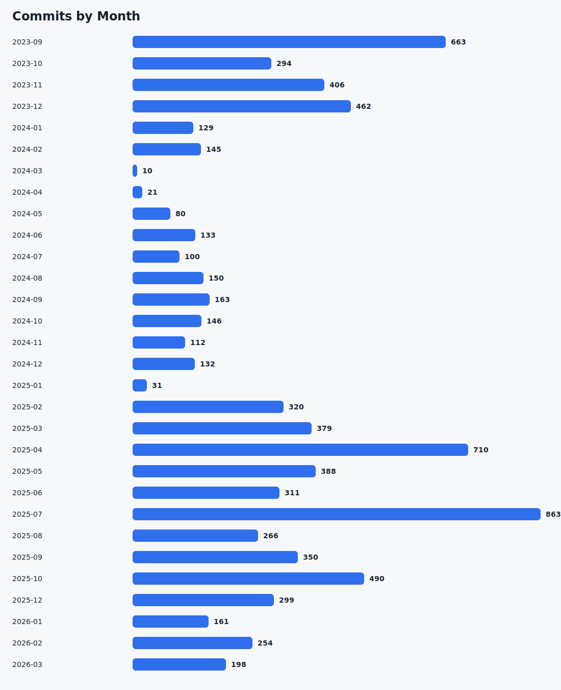
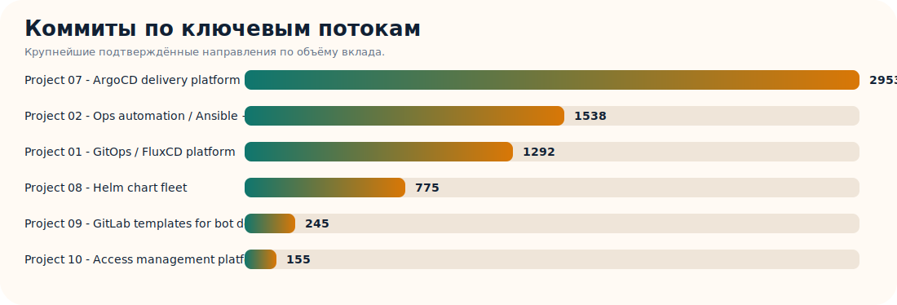
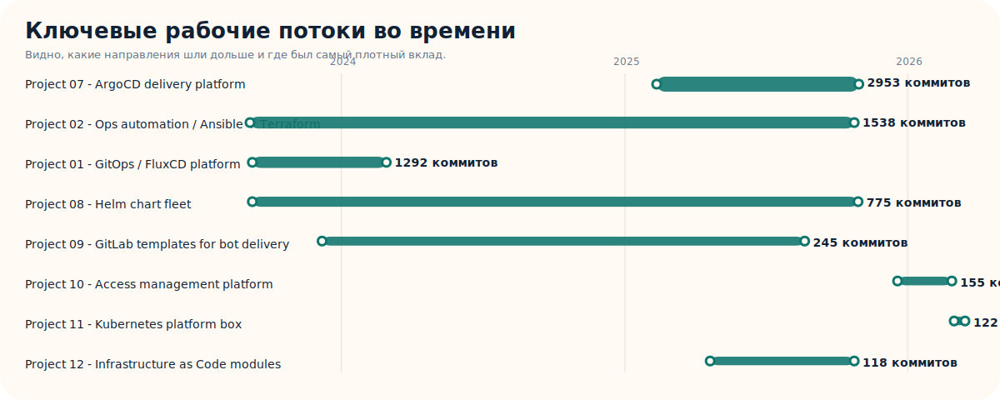

# DevOps Proof Portfolio

Этот репозиторий нужен не для публикации приватного клиентского кода, а для подтверждения опыта через артефакты:

- агрегированную статистику по git-истории;
- карту стека и типов инфраструктурных задач;
- короткие кейсы с результатами;
- публичные demo-проекты, которые можно локально запустить и проверить;
- графики активности и вклада по рабочим потокам;
- публичную ссылку, которую можно прикладывать в отклики и реферальные формы.

## Что уже подтверждено по локальной выгрузке

- Найдено `108` git-репозиториев в архиве рабочих папок.
- Найдено `8166` коммитов по нескольким авторским алиасам, связанным с твоей рабочей историей.
- Коммиты зафиксированы в `42` репозиториях с сохранённой историей.
- Основной подтверждённый период активности в текущей выгрузке: `2023-09` -> `2026-03`.
- Самые сильные подтверждённые зоны: `FluxCD / GitOps`, `Ansible`, `Terraform`, `Helm`, `Kubernetes`, `GitLab CI`.

Важно:

- Этот график и статистика строятся только по репозиториям, где локально сохранилась читаемая git-история.
- Часть более ранних рабочих копий, включая `swapp` и `eusy`, в текущем архиве содержит только неполные `.git`-скелеты без commit objects / refs, поэтому 2021-2022 могут быть недопредставлены в графиках, несмотря на фактическую работу в этот период.

## Зачем это помогает в найме

- HR видит не только резюме, но и верифицируемый цифровой след.
- Техлид получает быстрый вход: где именно был вклад, в каком стеке и с какой плотностью работы.
- Снижается недоверие к “накрученному” опыту, потому что вместо общих слов показывается структура работы, динамика коммитов и содержательные кейсы.
- Там, где git-история локально не сохранилась, можно показать отдельный non-git слой доказательств: topology, naming и декомпозицию по ролям, модулям и окружениям.

## Быстрые ссылки

- [Highlights](docs/HIGHLIGHTS.md)
- [Сводка активности](docs/ACTIVITY_SUMMARY.md)
- [Кейсы и результаты](docs/CASE_STUDIES.md)
- [Публичные demo-проекты](docs/PUBLIC_PROJECTS.md)
- [Короткий intro](docs/APPLICATION_BLURB.md)
- [JSON со статистикой](data/commit_summary.json)

## Графики

## Public Demo

- [platform-engineering-demo](projects/platform-engineering-demo/README.md) — публичный demo-репозиторий внутри портфолио: `Terraform + Kubernetes + GitHub Actions + Prometheus/Grafana/Loki`. Локально прогнан end-to-end через `kind`, deployment и smoke-test.

## Короткий Intro

DevOps / Platform Engineer. В дополнение к резюме приложил GitHub portfolio с подтверждаемыми артефактами по Kubernetes, Terraform, GitOps, CI/CD и observability: агрегированная статистика по рабочим git-репозиториям, кейсы и публичный demo-проект, который можно локально воспроизвести.
