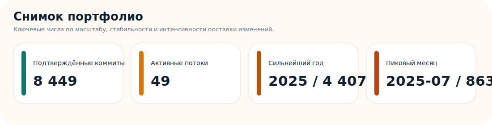
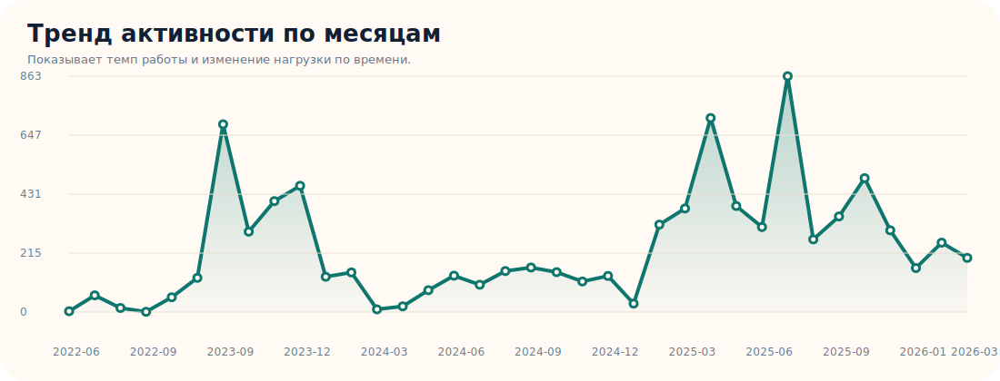
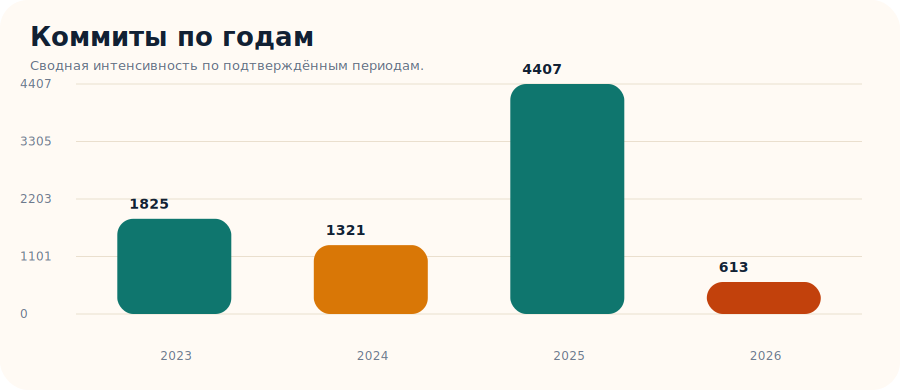
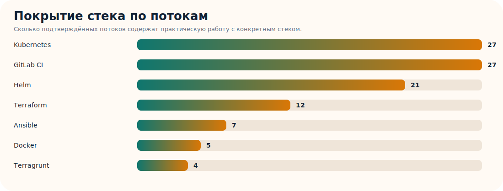
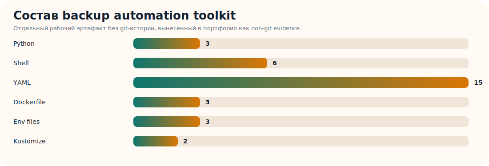

# Портфолио DevOps / Platform Engineer

Публичное портфолио с подтверждаемыми артефактами вместо приватного клиентского кода. Репозиторий собран на основе локального архива рабочих каталогов и показывает не только формулировки из резюме, но и реальный цифровой след: статистику по git-истории, графики активности, кейсы и воспроизводимый демо-стенд.

## Что здесь есть

- агрегированная статистика по рабочим git-репозиториям;
- графики по периодам, ключевым потокам и стеку;
- краткие кейсы по platform engineering / DevOps задачам;
- публичный демо-проект, который можно локально поднять и проверить.

## Быстрый старт для просмотра

- [Лендинг портфолио](index.html)
- [Ключевые выводы](docs/HIGHLIGHTS.md)
- [Сводка активности](docs/ACTIVITY_SUMMARY.md)
- [Кейсы](docs/CASE_STUDIES.md)
- [Публичные демо-проекты](docs/PUBLIC_PROJECTS.md)
- [Дополнительные артефакты](docs/ARTIFACT_EVIDENCE.md)
- [Сопоставление резюме и портфолио](docs/RESUME_PORTFOLIO_MAP.md)
- [Краткое описание](docs/APPLICATION_BLURB.md)
- [JSON со статистикой](data/commit_summary.json)

## Уже подтверждено по текущей выгрузке

- Найдено `108` git-репозиториев в локальном архиве.
- Подтверждено `8166` коммитов в `42` рабочих потоках с читаемой git-историей.
- Основной подтверждённый период активности: `2023-09` -> `2026-03`.
- Наиболее заметный стек по текущему архиву: `Kubernetes`, `Helm`, `Terraform`, `Ansible`, `GitLab CI`, `FluxCD / GitOps`.

Важно:

- Статистика строится только по тем каталогам, где локально сохранилась читаемая git-история.
- Часть более ранних рабочих копий, включая некоторые архивы `swapp` и `eusy`, в текущей выгрузке содержит неполные `.git`-структуры, поэтому ранние периоды могут быть недопредставлены в графиках.
- Отдельные рабочие артефакты без git-истории вынесены в специальный раздел `Дополнительные артефакты`, чтобы не смешивать non-git evidence с commit-метриками.

## Графики

## Публичный демо-проект

- [platform-engineering-demo](projects/platform-engineering-demo/README.md) — демонстрационный стенд внутри портфолио: `Terraform + Kubernetes + GitHub Actions + Prometheus/Grafana/Loki`. Прогнан локально end-to-end через `kind`, deployment и smoke-test.

## Кратко

DevOps / Platform Engineer. В дополнение к резюме приложено GitHub-портфолио с подтверждаемыми артефактами по Kubernetes, Terraform, GitOps, CI/CD и observability: агрегированная статистика по рабочим git-репозиториям, кейсы и публичный демо-проект, который можно локально воспроизвести.
