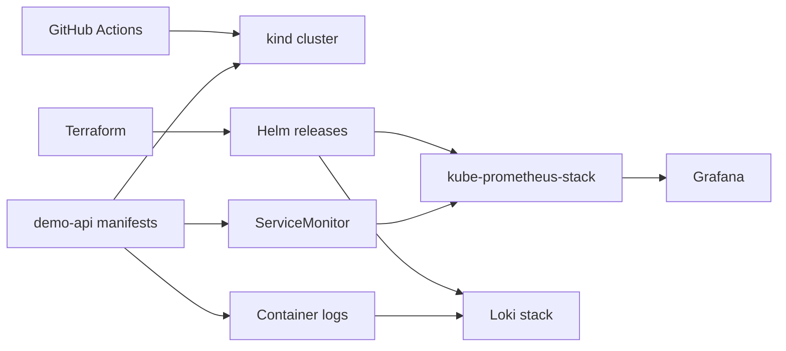

# Демо-стенд platform engineering

Демонстрационный проект для портфолио, который показывает практическую работу сразу по нескольким направлениям:

- bootstrap платформы через Terraform;
- доставка приложения в Kubernetes;
- CI/CD на GitHub Actions;
- метрики и логи через Prometheus, Grafana и Loki.

Репозиторий специально сделан как local-first демо. Он использует одноразовый `kind`-кластер, поэтому весь сценарий можно поднять на ноутбуке или в GitHub Actions без облачных учётных данных.

## Что это демонстрирует

- Terraform управляет платформенными add-on'ами через Helm;
- Kubernetes manifests описывают приложение в production-shaped виде;
- CI/CD не декоративный, а реально проверяет репозиторий и делает smoke deploy;
- observability встроена в приложение, а не добавлена постфактум.

## Архитектура



## Структура репозитория

```text
.
├── .github/workflows/ci.yml
├── app/
├── kind/
├── k8s/demo-api/
├── scripts/
├── terraform/
└── Makefile
```

## Быстрый локальный старт

Требования:

- `docker`
- `kind`
- `kubectl`
- `helm`
- `terraform`

Поднять кластер и платформу:

```bash
make kind-up
make tf-apply
make app-deploy
make smoke
```

`make kind-up` экспортирует отдельный kubeconfig в `.tmp/kubeconfig`, поэтому демо не зависит от состояния вашего `~/.kube/config`.
`make tf-apply` также инициализирует Helm-репозитории в изолированном локальном кеше `.tmp/helm`, чтобы не наследовать сломанные глобальные настройки рабочего окружения.

Открыть Grafana:

```bash
make grafana
```

Логин по умолчанию:

- user: `admin`
- password: `admin123`

Открыть Prometheus:

```bash
make prometheus
```

## Как устроен CI/CD

GitHub Actions pipeline состоит из двух jobs:

1. `validate`
   - `terraform fmt -check`
   - `terraform validate`
   - `kubectl kustomize` render check

2. `smoke`
   - создаёт временный `kind`-кластер
   - собирает образ приложения
   - загружает образ в `kind`
   - применяет Terraform-ресурсы платформы
   - деплоит manifests приложения
   - проверяет health и metrics

## Нюансы локального kind

- Репозиторий прогнан end-to-end на локальном `kind`-кластере.
- `HPA` здесь production-shaped, но обычный `kind` не отдаёт resource metrics из коробки. Приложение при этом разворачивается корректно; autoscaling становится активным, когда в кластере появляется metrics API.

## Почему структура именно такая

- `Terraform` отвечает за namespaces и платформенные сервисы.
- `Kubernetes manifests` отвечают за само приложение.
- `GitHub Actions` подтверждают, что репозиторий рабочий, а не декоративный.
- `kind` делает демо переносимым и дешёвым в запуске.

## Полезные команды

```bash
make fmt
make validate
make kind-up
make tf-apply
make app-deploy
make smoke
make grafana
make prometheus
make kind-down
```

## Дальше можно расширять

- добавить Argo CD для pull-based GitOps delivery;
- добавить policy checks через OPA или Kyverno;
- добавить alert rules и synthetic checks;
- добавить managed-cloud вариант для EKS или AKS.
