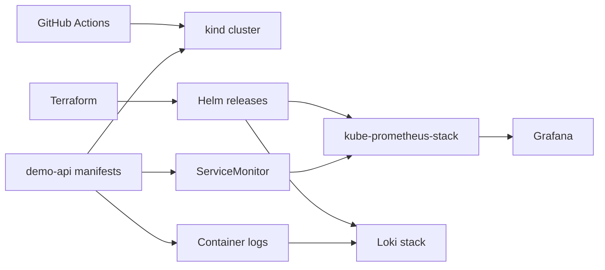

# Platform Engineering Demo

A portfolio-grade demo repository that proves practical work across:

- Terraform-driven platform bootstrap
- Kubernetes application delivery
- GitHub-based CI/CD
- Metrics and logs with Prometheus, Grafana, and Loki

This repo is intentionally local-first. It uses a disposable `kind` cluster so the whole flow can run on a laptop or inside GitHub Actions without cloud credentials.

## What This Demonstrates

- Terraform managing platform add-ons through Helm
- Kubernetes manifests for a production-shaped service
- CI/CD that validates the repo and performs a smoke deploy
- Observability wired into the application, not bolted on later

## Architecture



## Repo Layout

```text
.
├── .github/workflows/ci.yml
├── app/
├── kind/
├── k8s/demo-api/
├── scripts/
├── terraform/
└── Makefile
```

## Local Quick Start

Prerequisites:

- `docker`
- `kind`
- `kubectl`
- `helm`
- `terraform`

Bootstrap the cluster and platform:

```bash
make kind-up
make tf-apply
make app-deploy
make smoke
```

`make kind-up` exports a dedicated kubeconfig into `.tmp/kubeconfig`, so the demo does not depend on whatever is already in your personal `~/.kube/config`.
`make tf-apply` also bootstraps the required Helm repositories into an isolated local cache under `.tmp/helm`, so it does not inherit broken global Helm repo settings from your workstation.

Open Grafana:

```bash
make grafana
```

Default Grafana login:

- user: `admin`
- password: `admin123`

Open Prometheus:

```bash
make prometheus
```

## CI/CD Flow

The GitHub Actions pipeline does two jobs:

1. `validate`
   - `terraform fmt -check`
   - `terraform validate`
   - `kubectl kustomize` render check

2. `smoke`
   - creates an ephemeral `kind` cluster
   - builds the app image
   - loads the image into `kind`
   - applies Terraform platform resources
   - deploys the app manifests
   - verifies health and metrics

## Notes About Local kind

- The repo was validated end-to-end on a local `kind` cluster.
- The included HPA object is production-shaped, but plain `kind` does not ship resource metrics by default. The workload still deploys correctly; autoscaling signals become active once the cluster exposes the metrics API.

## Why This Is Structured This Way

- `Terraform` owns namespaces and platform services.
- `Kubernetes manifests` own the application workload.
- `GitHub Actions` proves the repo is runnable and not decorative.
- `kind` keeps the demo portable and cheap.

## Useful Commands

```bash
make fmt
make validate
make kind-up
make tf-apply
make app-deploy
make smoke
make grafana
make prometheus
make kind-down
```

## Next Extensions

- Add Argo CD for GitOps pull-based delivery
- Add policy checks with OPA or Kyverno
- Add alert rules and synthetic checks
- Add a managed-cloud variant for EKS or AKS
